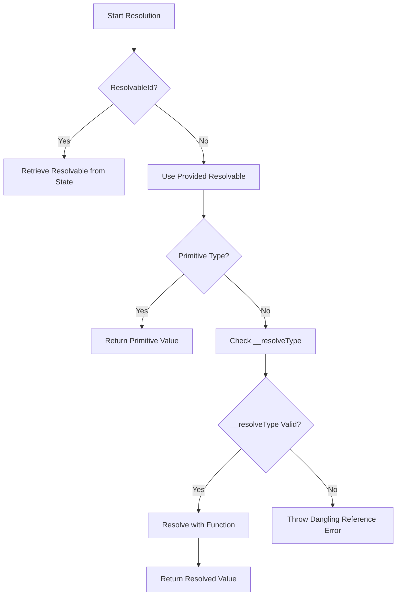
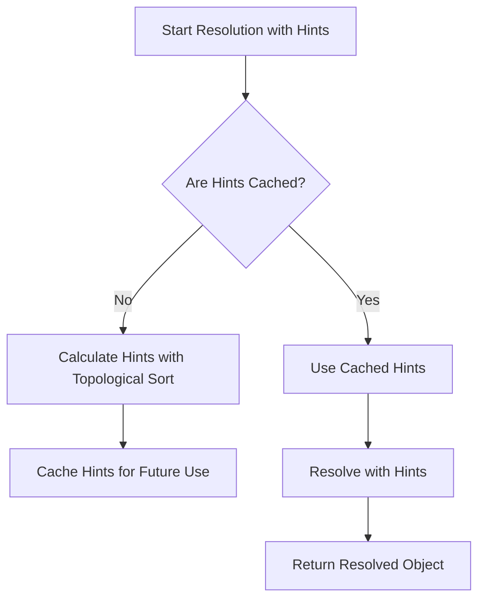
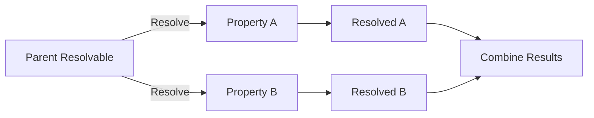

# deco Runtime - Config Resolver Engine

The `deco` runtime includes a powerful **Config Resolver Engine** written in
TypeScript. This engine takes a JSON object (referred to as a **Resolvable**)
and a set of functions (called **Resolvers**) to return a fully resolved
JavaScript object. The engine is inspired by GraphQL and is optimized for
efficiency by using topological sorting, which ensures that only the necessary
parts of the object are resolved.

## Key Concepts

### Resolvers

**Resolvers** are functions that receive a context and an input, producing an
output. They can be synchronous or asynchronous, and may optionally return
another **Resolvable**.

```typescript
export type AsyncResolver<
  T = any,
  TParent = any,
  TContext extends BaseContext = BaseContext,
> = (parent: TParent, context: TContext) => Promise<Resolvable<T> | T>;

export type SyncResolver<
  T = any,
  TParent = any,
  TContext extends BaseContext = BaseContext,
> = (parent: TParent, context: TContext) => Resolvable<T> | T;
```

### Resolvables

**Resolvables** are JSON objects with a special property `__resolveType` that
points to a **Resolver** or another **Resolvable**. If the `__resolveType`
reference is missing, a **DanglingReference** error is thrown, indicating an
invalid configuration.

#### Example

```json
{
  "loader-category-homens": {
    "category": "Homens",
    "__resolveType": "./loaders/VTEXProductList.ts"
  },
  "page-homens": {
    "sections": [
      {
        "products": {
          "__resolveType": "loader-category-homens"
        },
        "__resolveType": "./sections/ProductShelf.tsx"
      }
    ],
    "__resolveType": "$live/pages/LivePage.tsx"
  }
}
```

In the example above, `loader-category-homens` is referenced by `page-homens`.

### Resolution Algorithm

The resolution algorithm takes either a `Resolvable<T>` or a `ResolvableId` and
returns the resolved `T` value by following these steps:

1. Retrieve the **Resolvable** from the configuration state if an ID is
   provided.
2. Validate the `__resolveType` reference.
3. If the value is a primitive type, return it.
4. Recursively resolve objects and arrays.
5. Use the resolved value as input to the function referenced by
   `__resolveType`.
6. Repeat the algorithm if the result is another **Resolvable**.

**Note:** Resolvers take precedence over Resolvables in case of a name clash.



### Optimization in Version 1.15.1

In version 1.15.1, the algorithm introduced a structure called **hints**. Hints
are pre-calculated and cached to determine which fields should be resolved,
reducing unnecessary computation and improving performance. This optimization
eliminates the need for manual resolution of inner objects during the resolution
cycle.



### Parallelism in Resolution

The engine can resolve properties at the same level in parallel, significantly
improving performance.



This parallelism ensures that multiple properties within a resolvable can be
processed simultaneously, reducing the overall time required for resolution.

## Handling Dangling References

When a reference to a `__resolveType` cannot be found, a `DanglingReference`
error is thrown. The engine can be configured to either throw this error or
handle it gracefully by returning `null`.

```typescript
if (opts.nullIfDangling) {
  return Promise.resolve(null as T);
}

if (!ctx.danglingRecover) {
  throw new DanglingReference(resolveType);
}

return ctx.danglingRecover(props, ctx);
```
